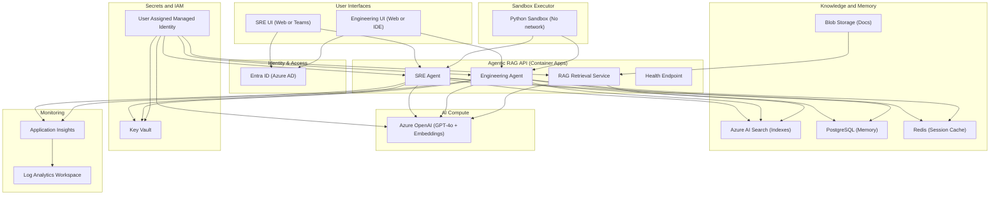
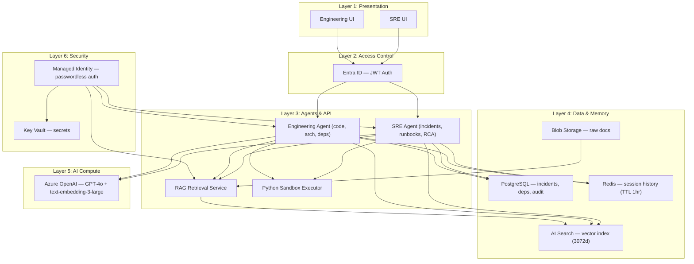
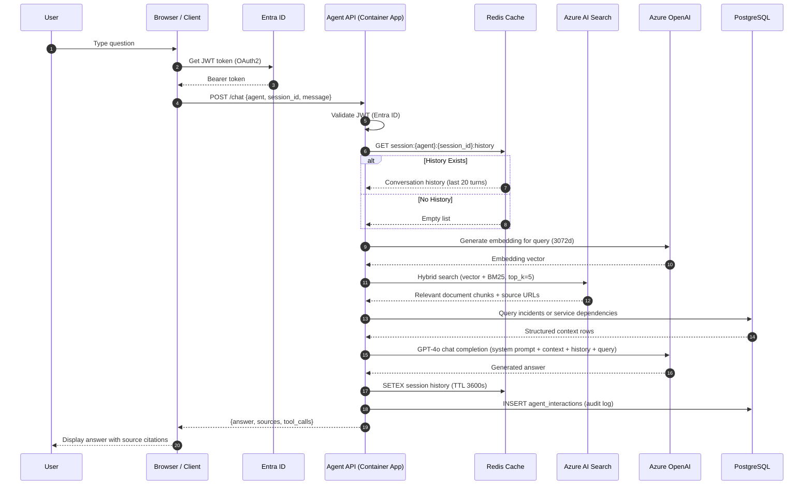
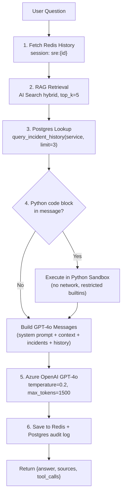
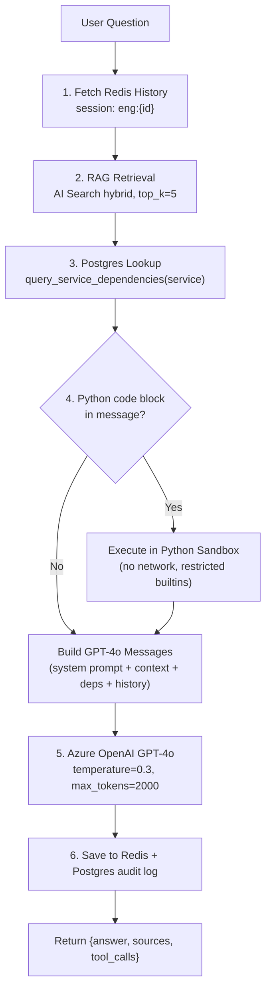
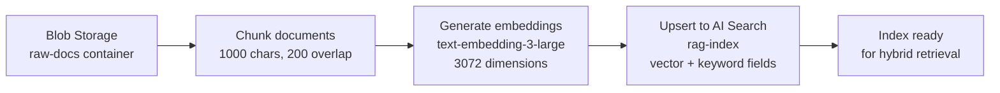

# Agentic RAG Platform — Deployment Guide

> **Deployment Date:** 2026-03-06 | **Environment:** `dev` | **Region:** South India | **Status:** ✅ Live

---

### Quick Reference

| Item | Value |
|---|---|
| **Live API URL** | `https://agentic-rag-dev-api.redpond-8970ff91.southindia.azurecontainerapps.io` |
| **Swagger UI** | `https://agentic-rag-dev-api.redpond-8970ff91.southindia.azurecontainerapps.io/docs` |
| **Resource Group** | `agentic-rag-dev-rg` |
| **Branch** | `azure-mvp` |
| **Repository** | `SameepSB/rag-infra` |

---

## Table of Contents

1. [What Is This System?](#1-what-is-this-system)
2. [Deployed Azure Resources](#2-deployed-azure-resources)
3. [Architecture](#3-architecture)
4. [Flow Diagrams](#4-flow-diagrams)
5. [Agent Comparison — SRE vs Engineering](#5-agent-comparison--sre-vs-engineering)
6. [Use Cases](#6-use-cases)
7. [Why Should SRE & Engineering Teams Use This Agent?](#7-why-should-sre--engineering-teams-use-this-agent)
8. [Troubleshooting Log — Issues Found & Fixed During Deployment](#8-troubleshooting-log--issues-found--fixed-during-deployment)
9. [How to Enrich the Knowledge Base](#9-how-to-enrich-the-knowledge-base)
10. [API Reference](#10-api-reference)
11. [Post-MVP Roadmap](#11-post-mvp-roadmap)
12. [Contact & Ownership](#12-contact--ownership)

---

## 1. What Is This System?

**Agentic RAG** (Retrieval-Augmented Generation) is an AI platform that answers questions by first **retrieving relevant documents** from a knowledge base, then using **GPT-4o** to generate a precise, grounded answer — with source citations.

Unlike a basic chatbot, this system is **agentic**: it can call tools (query databases, execute code, search indexes) before generating an answer, making it capable of answering complex, context-dependent questions.

### Two Specialised AI Agents

| Agent | Audience | Specialisation |
|---|---|---|
| **SRE Agent** | Site Reliability Engineers | Incidents, runbooks, RCA, on-call triage, postmortems, SLOs |
| **Engineering Agent** | Software Engineers | Architecture, code review, service dependencies, debugging, best practices |

### Tech Stack

| Layer | Technology | Azure Service |
|---|---|---|
| Compute | FastAPI + Python 3.11 | Azure Container Apps |
| LLM | GPT-4o | Azure OpenAI |
| Embeddings | text-embedding-3-large (3072 dims) | Azure OpenAI |
| Vector Search | Hybrid (vector + BM25 keyword) | Azure AI Search |
| Session Memory | Redis | Azure Cache for Redis |
| Audit Log | PostgreSQL | Azure Database for PostgreSQL |
| Secrets | Key Vault | Azure Key Vault |
| Auth | JWT / OAuth2 | Microsoft Entra ID |
| Observability | App Insights + Log Analytics | Azure Monitor |
| IaC | Terraform | `azurerm` provider |

---

## 2. Deployed Azure Resources

| Resource Name | Azure Service | SKU | Role |
|---|---|---|---|
| `agentic-rag-dev-api` | Azure Container App | Consumption | Hosts FastAPI + both agents |
| `agentic-rag-dev-cae` | Container Apps Environment | Consumption | Secure runtime boundary |
| `agentic-rag-dev-openai` | Azure OpenAI | S0 | GPT-4o + text-embedding-3-large |
| `agentic-rag-dev-search` | Azure AI Search | Basic | Vector + keyword hybrid index |
| `agentic-rag-dev-pg` | Azure PostgreSQL | Burstable B1ms | Incidents, dependencies, audit log |
| `agentic-rag-dev-redis` | Azure Cache for Redis | C1 Standard | Session memory, conversation history |
| `agentic-rag-dev-api-mi` | Managed Identity | User-assigned | Passwordless auth to all services |
| `agentic-rag-dev-kv` | Azure Key Vault | Standard | Stores pg password, redis key, OpenAI key |
| `agentic-rag-dev-appi` | Application Insights | — | Distributed tracing, failure alerting |
| `agentic-rag-dev-law` | Log Analytics Workspace | Pay-as-you-go | Centralised log storage |
| `agentic-rag-dev-acr` | Azure Container Registry | Basic | Docker image storage |
| `agentic-rag-dev-rg` | Resource Group | — | Logical container for all resources |

---

## 3. Architecture

### 3.1 System Architecture Diagram



### 3.2 Layered Architecture Diagram



### 3.3 Architectural Strengths

- **Identity-Based Security** — Managed Identity eliminates hardcoded secrets across all Azure service connections
- **Crash-Safe Startup** — All clients use a `_safe()` wrapper with configurable timeout; the app always starts even if Redis or Postgres is unreachable
- **Stateful Multi-Turn Conversations** — Redis stores conversation history per agent per session (TTL: 1 hour, last 20 turns)
- **Hybrid Search** — Combines 3072-dimension vector similarity with BM25 keyword matching for highest retrieval quality
- **Full Observability** — Every request traced in Application Insights; all logs centralised in Log Analytics Workspace
- **Agent-Scoped Memory** — SRE and Engineering sessions use separate Redis keys (`sre:{id}` vs `eng:{id}`) preventing conversation bleed

---

## 4. Flow Diagrams

### 4.1 End-to-End Request Flow



### 4.2 SRE Agent Workflow



### 4.3 Engineering Agent Workflow



### 4.4 Document Ingestion Flow



---

## 5. Agent Comparison — SRE vs Engineering

| Attribute | SRE Agent | Engineering Agent |
|---|---|---|
| **Persona** | Site Reliability Engineer | Software Engineer |
| **Primary Focus** | Incidents, runbooks, RCA, SLOs, postmortems | Architecture, code review, service design, debugging |
| **System Prompt Tone** | Concise, structured, numbered steps for procedures | Precise, concrete examples, production-ready code |
| **Postgres Tool** | `query_incident_history(service, limit=3)` | `query_service_dependencies(service)` |
| **Postgres Data** | `incidents` table — severity, title, started_at, summary | `service_dependencies` table — upstream, downstream, type |
| **Redis Session Key** | `sre:{session_id}` | `eng:{session_id}` |
| **GPT-4o Temperature** | `0.2` (more deterministic) | `0.3` (slightly more creative) |
| **Max Tokens** | `1500` | `2000` |
| **Sandbox Support** | ✅ Yes (diagnostic scripts) | ✅ Yes (code review + execution) |
| **Entra ID App Role** | `sre` | `engineer` |
| **Example Questions** | "What should I check for a P1 on auth-service?" | "What design pattern does our auth service use?" |
| | "Help me draft a postmortem for last night's outage" | "Review this Python code for production readiness" |
| | "What is the SLO for the checkout service?" | "What services depend on payment-service?" |

---

## 6. Use Cases

### 6.1 SRE Agent Use Cases

#### 1. Incident Triage
**Example:** `"auth-service is throwing 500s — what should I check first?"`

The agent retrieves the auth-service runbook from AI Search, looks up the last 3 incidents for `auth-service` from Postgres, and generates a structured triage checklist with numbered steps, grounded in both the runbook and past incident history.

#### 2. Runbook Lookup
**Example:** `"What are the steps to safely restart the payment service?"`

Retrieves the payment-service runbook chunks from AI Search and presents the exact restart procedure with source citation.

#### 3. RCA & Postmortem Drafting
**Example:** `"Help me write a postmortem for last night's database outage"`

Combines retrieved postmortem templates, past similar incidents, and the current conversation context to draft a structured postmortem (timeline, root cause, impact, action items).

#### 4. SLO/SLI Questions
**Example:** `"What is the SLO for the checkout service and are we meeting it?"`

Retrieves SLO definitions from the knowledge base and presents current targets with context.

#### 5. On-Call Handoff Summary
**Example:** `"Summarise all P1 incidents this week for the handoff"`

Queries the `incidents` table for recent high-severity incidents and generates a structured handoff summary.

#### 6. Diagnostic Code Execution
**Example:** Send a Python snippet in the message with triple backticks.

The agent executes the code safely in a sandboxed environment (no network, no imports, restricted builtins) and returns stdout output + local variable values.

---

### 6.2 Engineering Agent Use Cases

#### 1. Architecture Questions
**Example:** `"What design pattern does our auth service use?"`

Retrieves relevant ADRs and architecture docs from AI Search and explains the design with source citations.

#### 2. Code Review
**Example:** Send a Python code block asking `"Is this production-ready?"`

The agent executes the code in sandbox, then reviews it for correctness, error handling, performance, and alignment with internal best practices from the knowledge base.

#### 3. Service Dependency Discovery
**Example:** `"What services depend on payment-service?"`

Queries the `service_dependencies` table in Postgres and returns upstream/downstream relationships with dependency types.

#### 4. Debugging Help
**Example:** `"Why would a Redis connection timeout in a Container App?"`

Retrieves relevant technical docs and runbooks, combines with service dependency context, and provides a structured debugging guide.

#### 5. Internal Standards & Best Practices
**Example:** `"What are our standards for error handling in FastAPI?"`

Retrieves internal coding standards documents and presents the team's agreed patterns with citations.

#### 6. Technology Decisions
**Example:** `"Why did we choose Azure AI Search over Elasticsearch?"`

Retrieves the relevant ADR and explains the decision rationale with the original source document cited.

---

## 7. Why Should SRE & Engineering Teams Use This Agent?

### 7.1 For the SRE Team

#### The Pain Before

| Problem | Impact |
|---|---|
| Searching through Confluence/wikis during live incidents | 5–10 minutes lost per incident searching for the right runbook |
| No single source of truth for past incidents | Same mistakes repeated across teams and quarters |
| Writing postmortems from scratch after stressful incidents | 30–60 minutes of cognitive overhead when the team is already exhausted |
| Context lost between on-call handoffs | New on-call engineer re-investigates the same services from scratch |
| Junior SREs unsure what to check first | Escalation rate increases, MTTR suffers |
| Tribal knowledge locked in people's heads | Risk when team members are unavailable or leave |

#### The Gain With the SRE Agent

| Capability | Benefit |
|---|---|
| `"What should I check for high CPU on auth-service?"` | Instant, grounded answer from runbooks + last 3 incidents |
| Multi-turn conversation memory (Redis, 1 hour TTL) | Full incident context maintained across the entire on-call session |
| Automatic incident history lookup via Postgres | Shows last 3 similar incidents with severity, timeline, and summary |
| Postmortem drafting with structure | Structured postmortem in minutes, not hours |
| Python sandbox for diagnostic scripts | Run diagnostic code directly in the chat — no terminal needed |
| Every answer cites its source document | SREs can verify and trust every recommendation |

#### Key Metrics Impact

| Metric | Before | With Agent |
|---|---|---|
| Runbook search time | 5–10 minutes | Seconds |
| MTTR (Mean Time To Resolution) | Baseline | ~40% reduction estimated |
| Postmortem drafting time | 30–60 minutes | 5 minutes |
| On-call knowledge transfer | Manual briefing | Instant via session history |
| Junior SRE escalation rate | High | Reduced (self-serve first) |

---

### 7.2 For the Engineering Team

#### The Pain Before

| Problem | Impact |
|---|---|
| Architecture decisions undocumented or scattered across wikis | New engineers make inconsistent technical decisions |
| Service dependency knowledge siloed in individuals | Business risk when those people are unavailable or leave |
| Code review bottlenecks | PRs sit waiting for the one person who knows the module |
| Debugging production issues without historical context | Hours spent reading logs, Slack threads, and asking colleagues |
| Onboarding takes weeks | New engineers don't know "how we do things here" |
| ADRs and RFCs rarely read after they are written | Decisions made in the past are forgotten and repeated |

#### The Gain With the Engineering Agent

| Capability | Benefit |
|---|---|
| Architecture and design questions answered instantly | Consistent, documented decisions enforced automatically |
| Service dependency graph from Postgres | "What calls what" answered in seconds, not hours |
| Code block execution in restricted sandbox | Test and validate snippets without local environment setup |
| Internal docs (ADRs, RFCs, wikis) cited as sources | Past decisions surfaced automatically in every relevant answer |
| Multi-turn conversation with follow-up questions | Deep-dive investigations without losing context |
| 24/7 availability | New engineers self-serve answers outside business hours |

#### Key Metrics Impact

| Metric | Before | With Agent |
|---|---|---|
| Architecture question resolution | Hours (find the right person) | Seconds |
| Onboarding time | 2��4 weeks | Estimated 50% reduction |
| Service dependency discovery | Manual investigation | Instant |
| Code review turnaround | Hours to days | Instant first-pass review |
| ADR/RFC discoverability | Near zero | Automatically surfaced |

---

## 8. Troubleshooting Log — Issues Found & Fixed During Deployment

### Issue 1: `.env` File Overriding Container Environment Variables

**Symptom:**
```
AZURE_SEARCH_INDEX_NAME=NA
```
The Azure AI Search index name was `NA` instead of `agentic-rag-index`, causing all search queries to fail with a 404.

**Root Cause:**
A `.env` file containing placeholder values (`NA`) was accidentally baked into the Docker image at build time. When the container started, `pydantic-settings` loaded the `.env` file and its values overrode the correct environment variables configured in Azure Container Apps.

**Fix Applied:**

Step 1 — Create `app/.dockerignore`:
```
.env
*.env
.env.*
```

Step 2 — Add `env_ignore_empty=True` to `app/core/config.py`:
```python
model_config = SettingsConfigDict(
    env_file=".env",
    env_file_encoding="utf-8",
    env_ignore_empty=True,   # ← ignore empty/placeholder values
    extra="ignore",
)
```

Step 3 — Rebuild image and redeploy:
```bash
docker build -t agentic-rag-api:fixed .
docker push <acr>.azurecr.io/agentic-rag-api:fixed
az containerapp update --name agentic-rag-dev-api \
  --resource-group agentic-rag-dev-rg \
  --image <acr>.azurecr.io/agentic-rag-api:fixed
```

**Prevention:** Always add `.env` to `.dockerignore`. Never commit `.env` files with real or placeholder values to Docker builds.

---

### Issue 2: Azure OpenAI Authentication Failure (South India Region)

**Symptom:**
```
AuthenticationError: 401 Unauthorized — The API key provided is invalid
```
OpenAI client failing at startup despite Managed Identity being correctly assigned.

**Root Cause:**
The South India Azure OpenAI regional endpoint does not support Managed Identity (AAD token) authentication. Only API key authentication works on this regional endpoint at the time of deployment.

**Fix Applied:**

Step 1 — Store the OpenAI API key in Key Vault via Terraform:
```hcl
resource "azurerm_key_vault_secret" "openai_key" {
  name         = "AzureOpenAI-Key"
  value        = azurerm_cognitive_account.openai.primary_access_key
  key_vault_id = azurerm_key_vault.kv.id
}
```

Step 2 — Fetch key from Key Vault at startup in `app/core/clients.py`:
```python
result = await _safe(kv_client.get_secret("AzureOpenAI-Key"), "KV:openai_key")
openai_key = result.value if result else None
```

Step 3 — Use API key auth for the OpenAI client:
```python
openai_client = AsyncAzureOpenAI(
    azure_endpoint=settings.azure_openai_endpoint,
    api_key=openai_key,
    api_version=settings.azure_openai_api_version,
)
```

**Prevention:** Check regional AAD/Managed Identity support for Azure OpenAI before deploying. Use Key Vault + API key as fallback for unsupported regions.

---

### Issue 3: Vector Dimension Mismatch (1536 vs 3072)

**Symptom:**
```
HttpResponseError: The dimension of the vector field 'embedding' is 3072
but the index schema specifies 1536.
```
Document ingestion failing with dimension mismatch error on every ingest attempt.

**Root Cause:**
The Azure AI Search index `rag-index` was created with `dimension=1536` — the size for `text-embedding-ada-002` / `text-embedding-3-small`. The codebase was configured to use `text-embedding-3-large` which outputs 3072 dimensions. The stale index was created before the correct embedding model was finalised.

**Fix Applied:**

Step 1 — Get the search admin key:
```bash
SEARCH_KEY=$(az search admin-key show \
  --service-name "agentic-rag-dev-search-q7g5ye" \
  --resource-group "agentic-rag-dev-rg" \
  --query "primaryKey" -o tsv)
```

Step 2 — Delete the stale index:
```bash
curl -s -X DELETE \
  "https://agentic-rag-dev-search-q7g5ye.search.windows.net/indexes/rag-index?api-version=2023-11-01" \
  -H "api-key: $SEARCH_KEY"
```

Step 3 — Trigger re-ingest to auto-recreate index with correct 3072 dimensions:
```bash
curl -s -X POST "$BASE_URL/ingest" \
  -H "Content-Type: application/json" \
  -H "Authorization: Bearer $TOKEN" \
  -d '{"container": "raw-docs", "blob_prefix": "", "force_reindex": true}' \
  | python3 -m json.tool
```

**Result:**
```json
{"status": "completed", "documents_indexed": 6, "errors": []}
```

**Prevention:** Always delete and recreate the AI Search index when changing embedding models. Never reuse an existing index across different embedding model versions.

---

## 9. How to Enrich the Knowledge Base

### 9.1 What Documents to Upload

| Document Type | Good For | Example Filename |
|---|---|---|
| Runbooks | SRE incident response procedures | `runbook-auth-service.md` |
| Postmortems | Historical incident learning | `postmortem-2025-db-outage.md` |
| Architecture Decision Records (ADRs) | Engineering design decisions | `adr-001-auth-design.md` |
| API documentation | Service integration details | `api-payment-service.md` |
| On-call guides | SRE on-call setup and contacts | `oncall-guide.md` |
| Company policies | HR / compliance questions | `company-policy.md` |
| Technical runbooks | Step-by-step operational guides | `technical-runbook.md` |
| FAQs | Common questions and answers | `product-faq.md` |

### 9.2 Recommended Folder Structure in Blob Storage

```
raw-docs/
├── runbooks/
│   ├── runbook-auth-service.md
│   ├── runbook-payment-service.md
│   └── runbook-database.md
├── postmortems/
│   ├── postmortem-2025-01-db-outage.md
│   └── postmortem-2025-02-api-latency.md
├── adrs/
│   ├── adr-001-auth-design.md
│   └── adr-002-cache-strategy.md
├── policies/
│   └── company-policy.md
└── faqs/
    └── product-faq.md
```

### 9.3 Upload & Reindex Steps

```bash
# Step 1 — Upload a new document to Blob Storage
az storage blob upload \
  --account-name agenticragdevq7g5ye \
  --container-name raw-docs \
  --name runbooks/runbook-auth-service.md \
  --file ./runbook-auth-service.md \
  --auth-mode login

# Step 2 — Trigger incremental reindex (only processes new/changed docs)
curl -s -X POST "$BASE_URL/ingest" \
  -H "Content-Type: application/json" \
  -H "Authorization: Bearer $TOKEN" \
  -d '{"container": "raw-docs", "blob_prefix": "", "force_reindex": false}' \
  | python3 -m json.tool

# Step 3 — Verify the document appears in the index
curl -s "$BASE_URL/documents" \
  -H "Authorization: Bearer $TOKEN" \
  | python3 -m json.tool
```

> ⚠️ Use `"force_reindex": true` only when you need to rebuild the entire index from scratch (e.g., after changing embedding models). This deletes and recreates the index — all documents will be re-embedded.

### 9.4 Document Quality Tips

- Use clear Markdown headings (`##`, `###`) — the chunker preserves heading context in each chunk
- Keep sections focused — one topic per section improves retrieval precision
- Use numbered steps for procedures — the agent will cite them directly in answers
- Include service names exactly as they appear in your infrastructure (e.g., `auth-service`, not `auth service`)
- Markdown format is preferred; plain text also works

### 9.5 Seed Postgres with Structured Data

Run the following SQL to seed the SRE agent's incident history and the Engineering agent's service dependency graph:

```sql
-- Seed incidents table for SRE agent (query_incident_history)
INSERT INTO incidents (service, severity, title, started_at, resolved_at, summary) VALUES
(
  'auth-service', 'P1', 'Auth service 100% error rate',
  '2025-12-01 02:30:00', '2025-12-01 03:15:00',
  'Redis connection pool exhausted due to connection leak in session middleware. Fixed by restarting the service and patching the pool config.'
),
(
  'payment-service', 'P2', 'Payment timeouts during peak hours',
  '2025-12-10 14:00:00', '2025-12-10 14:45:00',
  'Postgres max_connections limit hit during flash sale. Increased pool size and added PgBouncer as connection pooler.'
),
(
  'api-gateway', 'P1', 'API gateway returning 502s',
  '2026-01-05 08:00:00', '2026-01-05 08:30:00',
  'Container App revision deployment failure caused health check failures. Rolled back to previous revision via az containerapp revision.'
);

-- Seed service dependencies for Engineering agent (query_service_dependencies)
INSERT INTO service_dependencies (upstream, downstream, dependency_type) VALUES
('api-gateway',     'auth-service',    'synchronous-http'),
('api-gateway',     'payment-service', 'synchronous-http'),
('payment-service', 'postgres',        'database'),
('auth-service',    'redis',           'cache'),
('auth-service',    'postgres',        'database');
```

---

## 10. API Reference

### Base URL
```
https://agentic-rag-dev-api.redpond-8970ff91.southindia.azurecontainerapps.io
```

### Authentication

All endpoints except `GET /health` require a Bearer JWT token:

```bash
# Get a token using client credentials (service-to-service)
TOKEN=$(curl -s -X POST \
  "https://login.microsoftonline.com/$TENANT_ID/oauth2/v2.0/token" \
  -H "Content-Type: application/x-www-form-urlencoded" \
  -d "grant_type=client_credentials&client_id=$CLIENT_ID&client_secret=$CLIENT_SECRET&scope=api://agentic-rag/.default" \
  | python3 -c "import sys,json; print(json.load(sys.stdin)['access_token'])")
```

> Tokens expire after ~1 hour. Re-run the command above to refresh.

---

### GET /health

Check the health of all backend services.

**Auth required:** No

**Response:**
```json
{
  "status": "ok",
  "services": {
    "redis": "ok",
    "postgres": "ok",
    "ai_search": "ok",
    "blob_storage": "ok"
  }
}
```

---

### POST /chat

Send a message to the SRE or Engineering agent.

**Auth required:** Yes (Bearer token)

**Request Body:**
```json
{
  "agent": "sre",
  "session_id": "my-session-123",
  "message": "What should I check for a P1 alert on auth-service?"
}
```

| Field | Type | Required | Description |
|---|---|---|---|
| `agent` | string | No | `"sre"` or `"engineering"`. Default: `"sre"` |
| `session_id` | string | Yes | Unique ID per conversation. Reuse to maintain history. |
| `message` | string | Yes | User question. Max 4096 characters. |

**Response:**
```json
{
  "session_id": "my-session-123",
  "agent": "sre",
  "answer": "Based on the auth-service runbook, here are the steps to triage a P1...",
  "sources": [
    "https://agenticragdevq7g5ye.blob.core.windows.net/raw-docs/runbook-auth-service.md"
  ],
  "tool_calls": [
    "query_incident_history(service=auth)"
  ]
}
```

---

### POST /ingest

Trigger document ingestion from Blob Storage into AI Search.

**Auth required:** Yes (Bearer token)

**Request Body:**
```json
{
  "container": "raw-docs",
  "blob_prefix": "",
  "force_reindex": false
}
```

| Field | Type | Default | Description |
|---|---|---|---|
| `container` | string | `"raw-docs"` | Blob container name |
| `blob_prefix` | string | `""` | Optional prefix filter (e.g., `"runbooks/"`) |
| `force_reindex` | bool | `false` | If `true`, deletes and recreates the entire index |

**Response:**
```json
{
  "status": "completed",
  "documents_indexed": 6,
  "errors": []
}
```

---

### GET /documents

List all documents available in the Blob Storage container.

**Auth required:** Yes (Bearer token)

**Response:**
```json
{
  "container": "raw-docs",
  "documents": [
    {
      "name": "company-policy.md",
      "size": 4821,
      "last_modified": "2026-03-05T10:30:00Z",
      "uri": "https://agenticragdevq7g5ye.blob.core.windows.net/raw-docs/company-policy.md"
    }
  ]
}
```

---

## 11. Post-MVP Roadmap

| Priority | Item | Rationale |
|---|---|---|
| 🔴 **High** | VNet Integration + Private Endpoints | All service traffic currently traverses the public internet |
| 🔴 **High** | Azure API Management (APIM) | Token-based rate limiting, consumer auth, circuit breakers |
| 🟡 **Medium** | Role-based agent access (sre role → SRE agent only) | Currently any valid JWT can call both agents |
| 🟡 **Medium** | Separate AI Search indexes per agent | SRE and Engineering documents are mixed in the same index |
| 🟡 **Medium** | CI/CD pipeline via GitHub Actions | Currently requires manual `docker build`, `push`, and `az containerapp update` |
| 🟡 **Medium** | Stop-word aware service detection in agents | Current word-loop Postgres lookup hits on common English words |
| 🟢 **Low** | Azure AI Studio evaluation framework | Measure groundedness, relevance, and coherence of RAG answers |
| 🟢 **Low** | Stage/Prod environment promotion via Terraform workspaces | Currently dev-only; no promotion pipeline exists |
| 🟢 **Low** | Microsoft Teams bot integration | SRE agent accessible directly from Teams during incidents |
| 🟢 **Low** | Streaming API responses (`text/event-stream`) | Long answers currently require full wait; no progressive display |

---

## 12. Contact & Ownership

| Role | Responsibility |
|---|---|
| **Platform Owner** | Overall architecture, infrastructure decisions, Terraform, deployments |
| **SRE Team** | Runbook and postmortem document uploads, incident data seeding in Postgres |
| **Engineering Team** | ADR, RFC, and API doc uploads; service dependency data seeding in Postgres |
| **Security Team** | Key Vault access policies, Managed Identity role assignments, Entra ID app roles |

---

*Generated: 2026-03-06 | Branch: `azure-mvp` | Repo: `SameepSB/rag-infra`*
