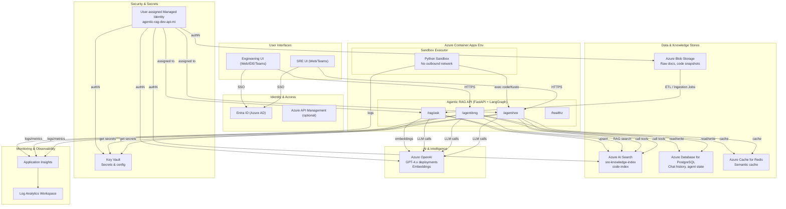

```mermaid
flowchart TD
classDef dark fill=#1e1e1e,stroke=#888,color=#eee;
classDef node fill=#2b2b2b,stroke=#999,color=#fff;
classDef accent fill=#004c99,stroke=#66aaff,color=#fff;

subgraph Clients["User Interfaces"]
    A1["SRE UI (Web/Teams)"]:::node
    A2["Engineering UI (VS Code/Portal)"]:::node
end:::dark

subgraph Access["Identity & Access"]
    B1["Entra ID AuthN/AuthZ"]:::accent
end:::dark

subgraph API["Agentic RAG API
(Azure Container Apps)"]
    C1["SRE Agent"]:::node
    C2["Engineering Agent"]:::node
    C3["RAG Service"]:::node
end:::dark

subgraph Data["Knowledge & Memory"]
    D1["Azure Blob Storage"]:::node
    D2["Azure AI Search"]:::node
    D3["Azure PostgreSQL"]:::node
    D4["Azure Redis Cache"]:::node
end:::dark

subgraph AI["AI Compute"]
    E1["Azure OpenAI
GPT‑4.1 / Embeddings"]:::accent
end:::dark

subgraph Security["Security"]
    F1["Key Vault"]:::node
    F2["User Assigned MI"]:::accent
end:::dark

A1 -->|SSO| B1
A2 -->|SSO| B1
A1 --> C1
A2 --> C2

C1 --> D2
C1 --> E1
C1 --> D3
C1 --> D4
C1 --> F1

C2 --> D2
C2 --> E1
C2 --> D3
C2 --> D4
C2 --> F1

C3 --> D2
C3 --> E1

D1 -->|ETL| C3

F2 --> C1
F2 --> C2
F2 --> C3
```
``



``
