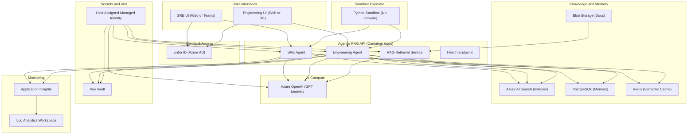
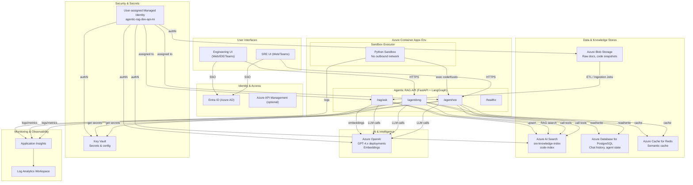

## Architecture Daigram

```mermaid
flowchart TD

subgraph Clients["User Interfaces"]
    A1["SRE UI (Web or Teams)"]
    A2["Engineering UI (Web or IDE)"]
end

subgraph Identity["Identity & Access"]
    B1["Entra ID (Azure AD)"]
end

subgraph API["Agentic RAG API (Container Apps)"]
    C1["SRE Agent"]
    C2["Engineering Agent"]
    C3["RAG Retrieval Service"]
    C4["Health Endpoint"]
end

subgraph Sandbox["Sandbox Executor"]
    S1["Python Sandbox (No network)"]
end

subgraph Data["Knowledge and Memory"]
    D1["Blob Storage (Docs)"]
    D2["Azure AI Search (Indexes)"]
    D3["PostgreSQL (Memory)"]
    D4["Redis (Semantic Cache)"]
end

subgraph AI["AI Compute"]
    E1["Azure OpenAI (GPT Models)"]
end

subgraph Security["Secrets and IAM"]
    F1["Key Vault"]
    F2["User Assigned Managed Identity"]
end

subgraph Observability["Monitoring"]
    G1["Application Insights"]
    G2["Log Analytics Workspace"]
end

%% Connections
A1 --> B1
A2 --> B1

A1 --> C1
A2 --> C2

C1 --> D2
C1 --> E1
C1 --> D3
C1 --> D4
C1 --> F1
C1 --> G1

C2 --> D2
C2 --> E1
C2 --> D3
C2 --> D4
C2 --> F1
C2 --> G1

C3 --> D2
C3 --> E1

S1 --> C1
S1 --> C2

D1 --> C3

F2 --> C1
F2 --> C2
F2 --> C3
F2 --> E1
F2 --> F1

G1 --> G2
```

```mermaid

flowchart TD

subgraph Clients["User Interfaces"]
    A1["SRE UI (Web/Teams)"]
    A2["Engineering UI (Web/IDE/Teams)"]
end

subgraph ID["Identity & Access"]
    B1["Entra ID (Azure AD)"]
    B2["Azure API Management (optional)"]
end

subgraph CAE["Azure Container Apps Env"]
    subgraph API["Agentic RAG API (FastAPI + LangGraph)"]
        C1["/agent/sre"]
        C2["/agent/eng"]
        C3["/rag/ask"]
        C4["/healthz"]
    end

    subgraph Sandbox["Sandbox Executor"]
        S1["Python Sandbox
No outbound network"]
    end
end

subgraph Data["Data & Knowledge Stores"]
    D1["Azure Blob Storage
Raw docs, code snapshots"]
    D2["Azure AI Search
sre-knowledge-index
code-index"]
    D3["Azure Database for PostgreSQL
Chat history, agent state"]
    D4["Azure Cache for Redis
Semantic cache"]
end

subgraph AI["AI & Intelligence"]
    E1["Azure OpenAI
GPT-4.x deployments
Embeddings"]
end

subgraph Sec["Security & Secrets"]
    F1["Key Vault
Secrets & config"]
    F2["User-assigned Managed Identity
agentic-rag-dev-api-mi"]
end

subgraph Mon["Monitoring & Observability"]
    G1["Application Insights"]
    G2["Log Analytics Workspace"]
end

%% Connections
A1 -->|SSO| B1
A2 -->|SSO| B1

A1 -->|HTTPS| C1
A2 -->|HTTPS| C2

C1 -->|call tools| D2
C1 -->|LLM calls| E1
C1 -->|read/write| D3
C1 -->|cache| D4
C1 -->|get secrets| F1
C1 -->|logs/metrics| G1

C2 -->|call tools| D2
C2 -->|LLM calls| E1
C2 -->|read/write| D3
C2 -->|cache| D4
C2 -->|get secrets| F1
C2 -->|logs/metrics| G1

C3 -->|RAG search| D2
C3 -->|LLM calls| E1

S1 -->|exec code/Kusto| C1
S1 -->|logs| G1

D1 -->|"ETL / Ingestion Jobs"| C3
C3 -->|embeddings| E1
C3 -->|upsert| D2

F2 -->|assigned to| C1
F2 -->|assigned to| C3
F2 -->|authN| D1
F2 -->|authN| D2
F2 -->|authN| E1
F2 -->|authN| F1

G1 --> G2

```
``
